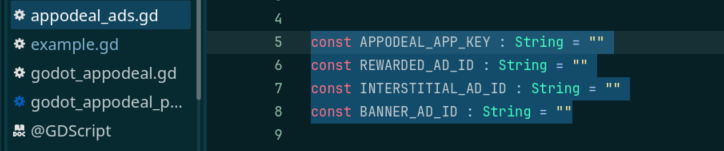
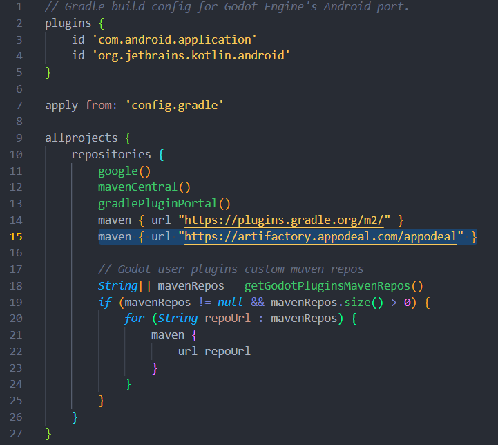
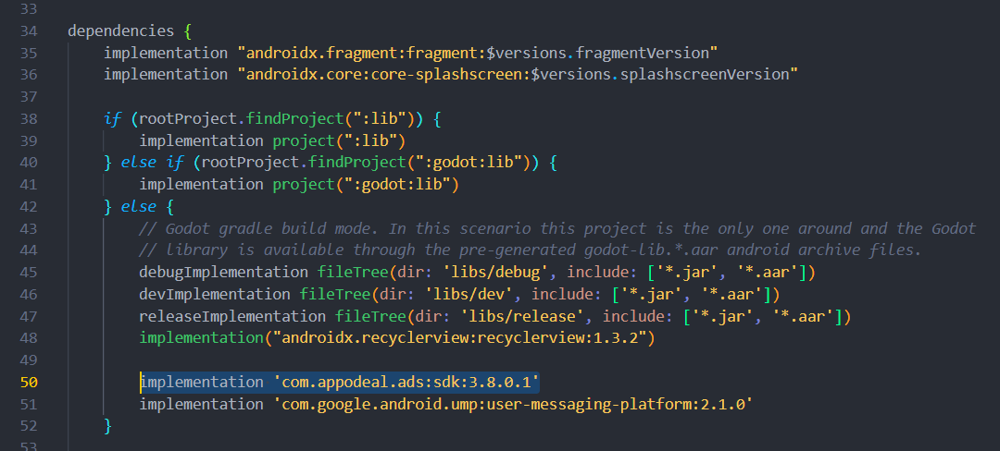
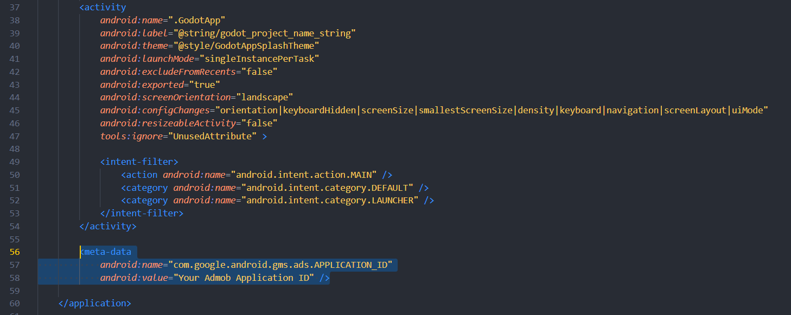
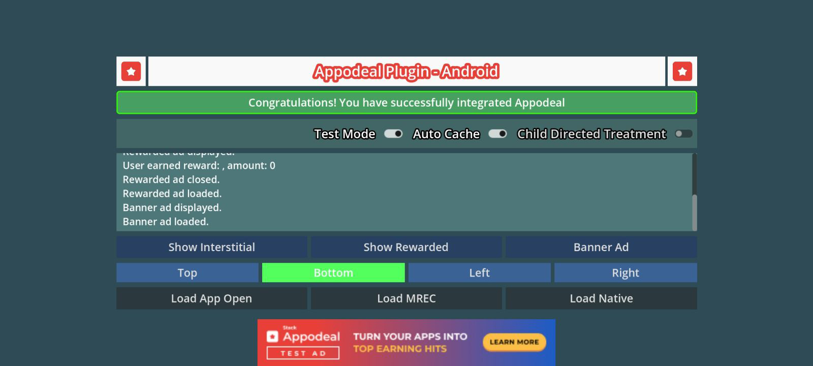

[](https://github.com/ferdouseO/godot-appodeal-android-plugin/releases)
[](https://github.com/poingstudios/godot-admob-android)


# 🦾Godot Appodeal Plugin (Android)

Use this addon to integrate Appodeal ad mediation to your godot project. Supports Android only (iOS support will be added soon).


# 📦Installation
## 📥Godot Asset Library (recommended)

1. Find the Appodeal plugin in the AssetLibrary.
2. Click Download and Install.
3. Enable the plugin in Project→Project Settings→Plugins.

## Manual install

1. Go to [Releases](https://github.com/ferdouseO/godot-appodeal-android-plugin/release)
2. Download and extract as a `.zip` or `.tar.gz`
3. Copy the extracted `addons/appodeal` folder into `res://addons` on your project
4. Enable the plugin in Project→Project Settings→Plugins.


# 🙋‍♂️How to use
Find the `addons/appodeal/example/scenes/example.tscn` scene for referance use.
You can use the `addons/appodeal/appodeal_ads.gd` script as a Singletone/Global Script to use all the functionalities of the plugin.
- Put your Appodeal App key and ad ids in the appodeal_ads.gd file.



# 📦Export to android
1. Install Android Build Template.
2. Copy the "godotappodeal.aar" archive from addons/appodeal and pest it to "project > android > build > libs > debug" for debug and to "project > android > build > libs > release" for release build.
3. Add maven dependency `maven { url "https://artifactory.appodeal.com/appodeal" }` at the repositories section of your "project > android > build > build.gradle" file.

4. Add `implementation 'com.appodeal.ads:sdk:3.8.0.1'` in the dependency section of your "project > android > build > build.gradle" file.

5. If you add Google admob with appodeal mediation, add your admob application id to the "project > android > build > AndroidManifest.xml" file.
```xml
<meta-data
	android:name="com.google.android.gms.ads.APPLICATION_ID"
	android:value="Your Admob Application ID" />
```

6. Enable `Gradle Build` in your Android export preset.

## GDPR/User Concent

1. If you use Google UMP for GDPR, Add `implementation 'com.google.android.ump:user-messaging-platform:2.1.0'` in the dependency section of your "project > android > build > build.gradle" file.


# 📦Debug
1. Connect an android device and run the example scene.
2. The example app also has a debug window that logs everything.



## 📎Useful links:
- Find the Godot Appodeal android library [Here](https://github.com/ferdouseO/godot-appodeal-android-library)
- Appodeal official android documentation [Link](https://docs.appodeal.com/android/get-started)


## 🙏 Support
If you find my work useful and would like to support...


[](https://coff.ee/ferdouse_o)


Your support helps continue to improve and maintain this plugin. Thank you for being a part of this development!


## ⭐ Stars matter
Don't forget to inspire by giving a star on GitHub! ⭐

